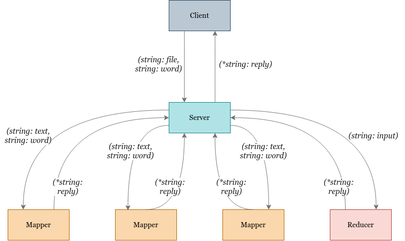

# Distributed Grep

[](https://circleci.com/gh/matt-merman/DistributedGrep/tree/main)

## Goal

Realize a distributed grep using the **MapReduce** paradigm: DistGrep returns the lines of text of a large input file given in input that match a specific pattern (i.e., regular expression) specified.

## Main Ideas

1. Map phase: 
    
    Process the _N_ files/blocks in parallel on workers, applying the map function (i.e., local 
    grep) to each file/block:
    * Master assigns the N files/blocks to workers, that execute the map task;
    * To implement the local grep, you can use the package strings and the functions it provides;
    * Each map task can either write its results to (some number of) intermediate file(s) or send its results to the master or the reduce tasks; 
      * You can choose to realize the shuffle and sort phase either in a centralized or decentralized way;

2. Shuffle and sort phase: 
   
   Organize output of map tasks in such a way that input data received by reduce tasks is grouped by key;

3. Reduce phase: 
   
   Each reduce task processes its input and sends it to the master:
   * In our case, the reduce phase uses the identity function;
   * Master merges all outputs from reduce tasks and produces final result;

## Running

To run the application:

```bash
#Build and run server, mappers and reducer in background
make server_run

#Build and run client
make client_run

#Terminate server, mappers and reducer
make kill

#Remove .out files
make clean
```

>NOTICE: _3_ mappers are generated by default. The search word is _cats_ in the file _cats.txt_. You can edit input in the make file. The number of mappers is defined as constant in the file _server.go_:

```go
const NUMBER_MAPPER = 3
```

## Implementation

