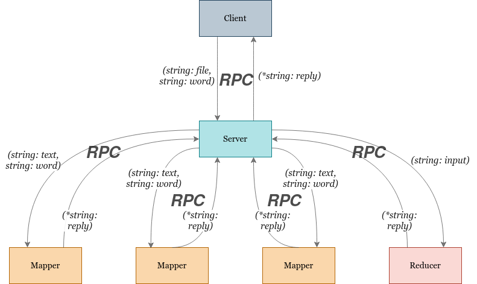
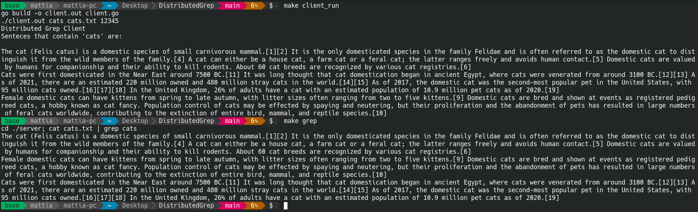
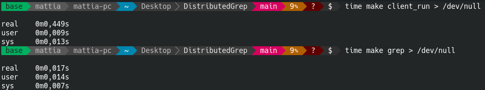

# Distributed Grep

[](https://circleci.com/gh/matt-merman/DistributedGrep/tree/main)

## Goal

Realize a distributed grep using the **MapReduce** paradigm: _Grep_ returns the lines of text of a large input file given in input that match a specific pattern (i.e., regular expression) specified.

## Main Ideas

1. Map phase: 
    
   Process the _N_ files/blocks in parallel on workers, applying the map function (i.e., local grep) to each file/block:
   * Master assigns the N files/blocks to workers, that execute the map task;
   * Each map task send its results to the master task; 

2. Shuffle and sort phase: 
   
   It is centralized (on master) and does nothing;

3. Reduce phase: 
   
   Each reduce task processes its input and sends it to the master:
   * In our case, the reduce phase uses the identity function;

## Running

```bash
#Build and run server, mappers and reducer in background
make server_run

#Build and run client
make client_run

#Terminate server, mappers and reducer
make kill

#Remove .out files
make clean

#Execute classical grep
make grep
```

>NOTICE: _3_ mappers are generated by default. The search word is _cats_ in the file _cats.txt_. You can edit input in the make file. The number of mappers is defined as constant in the file _server.go_:

```go
const NUMBER_MAPPER = 3
```

## Implementation



## Example



## Performance

A _2.2MB_ .txt file (_lorem.txt_) has been used to measure performance. Obviously the classical grep has taken less time to execute.

